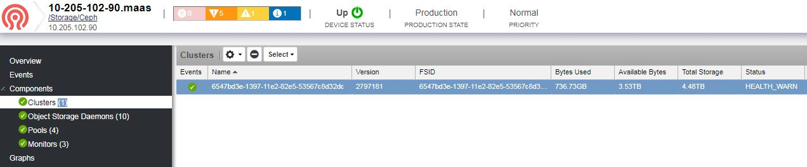

# ZenPacks.itri.Ceph

Monitor Ceph clusters, object storage daemons, pools, and monitors.

## Configuration

Make sure that SSH command monitoring is correctly configured in Zenoss.
You might need to set valid `zCommandUsername` and `zCommandPassword`
or a valid `zKeyPath`  for the `/Storage/Ceph` device class

## Usage

After the ZenPack is installed, add a device containing Ceph to the 
`/Storage/Ceph` device class. 

If SSH is correctly configured in your Zenoss environment, then you do not need
to do anything else.

When the device is added and finished being modeled, the Ceph data should be
displayed:

